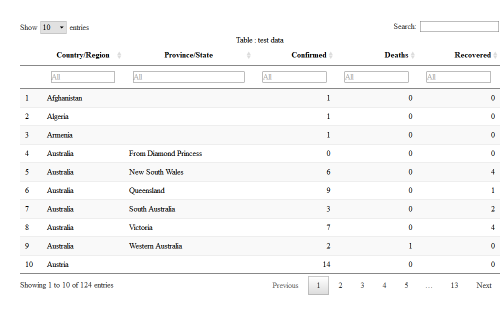
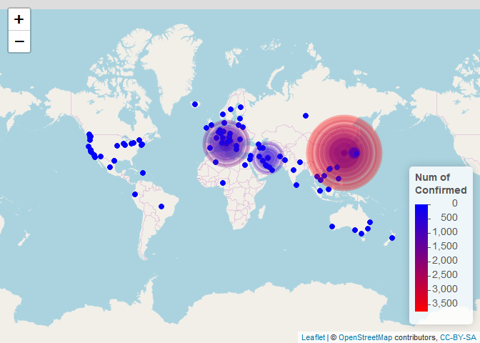
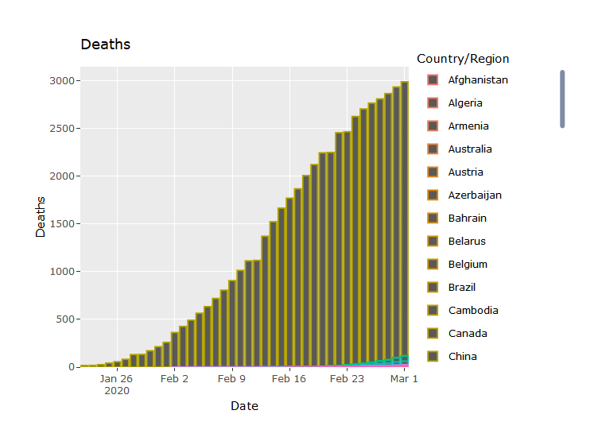
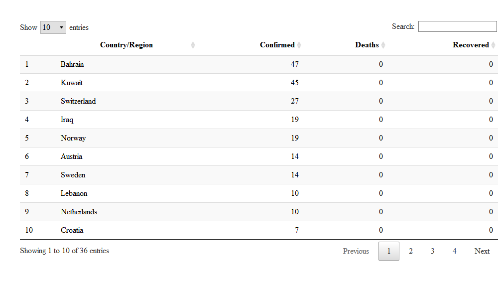
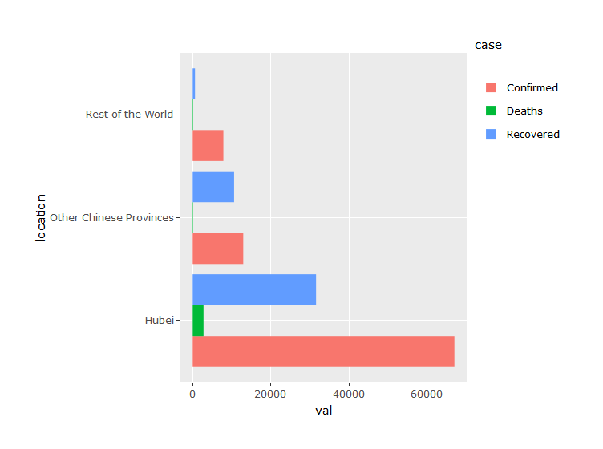
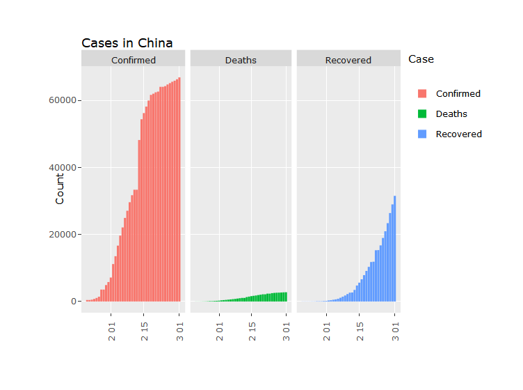
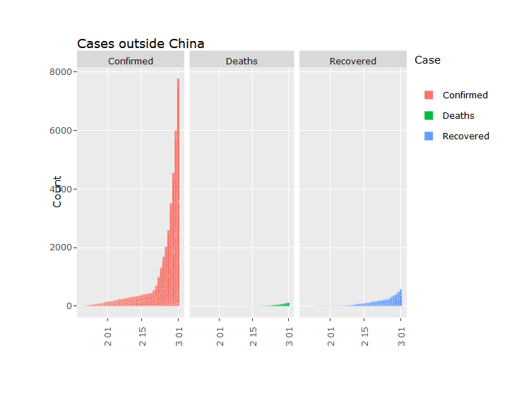
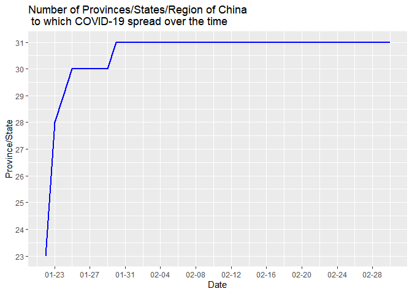
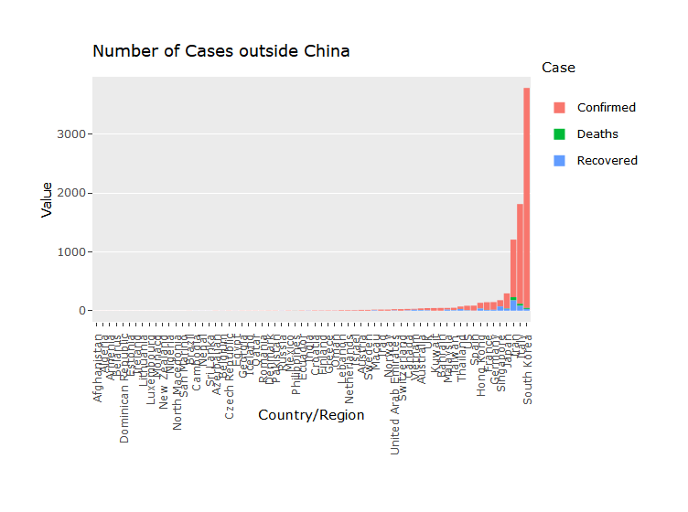

Corona-19 from Jan-22 to Feb-26
================

-   [Libraries](#libraries)
-   [Dataset](#dataset)
-   [Preprocessing](#preprocessing)
    -   [Cleaning Data](#cleaning-data)
    -   [Derived Tables](#derived-tables)
    -   [Complete Data](#complete-data)
    -   [Country Wise Latest Data](#country-wise-latest-data)
    -   [Chines Province Wise Latest Data](#chines-province-wise-latest-data)
-   [Map](#map)
    -   [Reported cases over the world](#reported-cases-over-the-world)
    -   [Reported cases in China](#reported-cases-in-china)
    -   [Cases in differnt Countries](#cases-in-differnt-countries)
    -   [Spread over the time](#spread-over-the-time)
    -   [Countries with deaths reported](#countries-with-deaths-reported)
    -   [Countries and Provinces with no recovered cases](#countries-and-provinces-with-no-recovered-cases)
    -   [Countries and Provinces with no affected case anymore](#countries-and-provinces-with-no-affected-case-anymore)
    -   [Countries and Provinces with all the cases recovered](#countries-and-provinces-with-all-the-cases-recovered)
    -   [Diamond Princess Cruise ship Status](#diamond-princess-cruise-ship-status)
-   [Hubei - China - World](#hubei---china---world)
-   [Number of new cases everyday](#number-of-new-cases-everyday)
    -   [Number of Cases](#number-of-cases)
-   [Number of Places to which COVID-19 Spread](#number-of-places-to-which-covid-19-spread)
-   [Recovery and Mortality Rate Over The Time](#recovery-and-mortality-rate-over-the-time)
-   [Proportion of Cases](#proportion-of-cases)
-   [Number of cases](#number-of-cases-1)
-   [Number of new cases](#number-of-new-cases)
-   [Number of Countries with new cases](#number-of-countries-with-new-cases)
-   [refer](#refer)
    -   [What i have to study later.](#what-i-have-to-study-later.)

Libraries
---------

``` r
library(data.table)
library(tidyverse)
library(lubridate) # to manipulate Date class
library(stringr)
library(scales)   # for using scale_x_date

library(DT)
library(plotly)
library(treemap)  # for drawing treemap

library(rgeos)
library(maps)
library(maptools)
library(leaflet)   # interative map
```

Dataset
-------

``` r
full_table <-fread("covid_19_clean_complete.csv", data.table = F)
```

Preprocessing
-------------

### Cleaning Data

``` r
full_table$`Country/Region` <- str_replace(full_table$`Country/Region`,'Mainland China','China')

# filling missing values with NA
full_table$`Province/State`[full_table$`Province/State`==""] <- NA
full_table$index <- 1:nrow(full_table)
```

``` r
full_table$Date <- str_replace(full_table$Date,"2002","2020")
full_table$Date <- gsub(pattern = "-20$", replacement = "-02",x = full_table$Date)

datatable(full_table, caption = "Table : test data",
          filter = 'top', options = list(pageLength = 10, autoWidth = TRUE))
```


[Click! if you want to view the full\_table](https://raw.githack.com/koojaekwan/Corona-19/master/html_files/full_table.html)

``` r
temp<-full_table %>% filter(str_length(full_table$Date)==10)
temp2<-full_table %>% filter(str_length(full_table$Date)!=10)


temp$Date<-ydm(temp$Date)
temp2$Date<-mdy(temp2$Date)
```

``` r
full_table<-rbind(temp,temp2) %>% arrange(index)
```

### Derived Tables

``` r
`%notin%` <- Negate(`%in%`)  # user function

ship <- full_table  %>% filter(`Province/State`=="Diamond Princess cruise ship")
full_table <- full_table %>% filter(full_table$index %notin% ship$index)
# full_table <- full_table %>% filter(!(full_table$index %in% ship$index))


china <- full_table %>% filter(`Country/Region`=="China") 
row <- full_table %>% filter(`Country/Region`!="China") 


full_latest <- full_table %>% filter(full_table$Date==max(full_table$Date))
china_latest <- full_latest %>% filter(full_latest$`Country/Region`=="China")
row_latest <- full_latest %>% filter(full_latest$`Country/Region`!="China")

full_latest_grouped <- full_latest %>% 
  group_by(`Country/Region`) %>% 
  summarise(Confirmed = sum(Confirmed),
            Deaths = sum(Deaths),
            Recovered = sum(Recovered))

china_latest_grouped <- china_latest %>% 
  group_by(`Province/State`) %>% 
  summarise(Confirmed = sum(Confirmed),
            Deaths = sum(Deaths),
            Recovered = sum(Recovered))

row_latest_grouped <- row_latest %>% 
  group_by(`Country/Region`) %>% 
  summarise(Confirmed = sum(Confirmed),
            Deaths = sum(Deaths),
            Recovered = sum(Recovered))
```

``` r
tmp<- full_table %>% 
      group_by(Date) %>% 
      summarise(Confirmed = sum(Confirmed),
                Deaths = sum(Deaths),
                Recovered = sum(Recovered)) %>% 
      arrange(Date)

tmp %>% tail(1) %>% data.frame
```

    ##         Date Confirmed Deaths Recovered
    ## 1 2020-02-26     80692   2766     30374

### Complete Data

``` r
tmp<-full_latest %>% 
  group_by(`Country/Region`, `Province/State`) %>% 
  summarise(Confirmed = max(Confirmed),
            Deaths = max(Deaths),
            Recovered = max(Recovered))

datatable(tmp, caption = "Table : test data",
          filter = 'top', options = list(pageLength = 10, autoWidth = TRUE))
```



### Country Wise Latest Data

``` r
tmp<-full_latest_grouped %>% 
  arrange(-Confirmed)
  
datatable(tmp, caption = "Table : test data",
          filter = 'top', options = list(pageLength = 10, autoWidth = TRUE))
```


### Chines Province Wise Latest Data

``` r
tmp <- china_latest_grouped %>% 
  arrange(-Confirmed)

datatable(tmp, caption = "Table : test data",
          filter = 'top', options = list(pageLength = 10, autoWidth = TRUE))
```


Map
---

### Reported cases over the world

``` r
# World wide - except for ship

full_latest_Hubei<-full_latest %>% filter(`Province/State` %in% "Hubei")
full_latest_other<-full_latest %>% filter(`Province/State` %notin% "Hubei")


mnpopup1 <- paste0("<li>Country: ", as.character(full_latest_other$`Country/Region`), "<br>",
                   "<li>Province: ", as.character(full_latest_other$`Province/State`), "<br>",
                   "<li>ConFirmed: ", as.character(full_latest_other$Confirmed), "<br>",
                   "<li>Deaths: ", as.character(full_latest_other$Deaths), "<br>",
                   "<li>Recovered: ", as.character(full_latest_other$Recovered), "<br>")

mnpopup2 <- paste0("<li>Country: ", as.character(full_latest_Hubei$`Country/Region`), "<br>",
                   "<li>Country: ", as.character(full_latest_Hubei$`Province/State`), "<br>",
                   "<li>ConFirmed: ", as.character(full_latest_Hubei$Confirmed), "<br>",
                   "<li>Deaths: ", as.character(full_latest_Hubei$Deaths), "<br>",
                   "<li>Recovered: ", as.character(full_latest_Hubei$Recovered), "<br>")


labs1 <- lapply(seq(nrow(full_latest_other)), function(i) {
  paste0( '<b>',"Country: ","</b>" , full_latest_other[i, "Country/Region"], '<br>', 
          '<b>',"Province: ","</b>" , full_latest_other[i, "Province/State"], '<br>',
          '<b>',"ConFirmed: ","</b>" , full_latest_other[i, "Confirmed"], '<br>',
          '<b>',"Deaths: ","</b>", full_latest_other[i, "Deaths"], '<br>', 
          '<b>',"Recovered: ","</b>", full_latest_other[i, "Recovered"],'<br>') 
})

labs2 <- lapply(seq(nrow(full_latest_Hubei)), function(i) {
  paste0( '<b>',"Country: ","</b>" , full_latest_Hubei[i, "Country/Region"], '<br>', 
          '<b>',"Province: ","</b>" , full_latest_Hubei[i, "Province/State"], '<br>',
          '<b>',"ConFirmed: ","</b>" , full_latest_Hubei[i, "Confirmed"], '<br>',
          '<b>',"Deaths: ","</b>", full_latest_Hubei[i, "Deaths"], '<br>', 
          '<b>',"Recovered: ","</b>", full_latest_Hubei[i, "Recovered"],'<br>') 
})


leaflet(data=full_latest) %>% addTiles() %>%  
  
  addCircleMarkers(data=full_latest_other,
                   ~Long, ~Lat, 
                   popup = mnpopup1, label = lapply(labs1, htmltools::HTML),
                   radius = ~Confirmed/300, color="blue") %>% 
  
  addCircleMarkers(data = full_latest_Hubei,
                   ~Long, ~Lat, 
                   popup = mnpopup2, label = lapply(labs2, htmltools::HTML),
                   radius = ~Confirmed/8000, color = "red")
```



### Reported cases in China

``` r
china_latest_other<-china_latest %>% filter(`Province/State`!="Hubei")
china_latest_Hubei<-china_latest %>% filter(`Province/State`=="Hubei")


mnpopup1 <- paste0("<b>","Province: ","</b>", as.character(china_latest_other$`Province/State`), "<br>",
                   "<b>","ConFirmed: ","</b>", as.character(china_latest_other$Confirmed), "<br>",
              "<b>", "Deaths: ", "</b>", as.character(china_latest_other$Deaths), "<br>",
              "<b>", "Recovered: ", "</b>", as.character(china_latest_other$Recovered), "<br>")

mnpopup2 <- paste0("<b>","Province: ","</b>", as.character(china_latest_Hubei$`Province/State`), "<br>",
                   "<b>","ConFirmed: ","</b>", as.character(china_latest_Hubei$Confirmed), "<br>",
              "<b>", "Deaths: ", "</b>", as.character(china_latest_Hubei$Deaths), "<br>",
              "<b>", "Recovered: ", "</b>", as.character(china_latest_Hubei$Recovered), "<br>")


labs1 <- lapply(seq(nrow(china_latest_other)), function(i) {
  paste0( '<b>',"Province: ","</b>" , china_latest_other[i, "Province/State"], '<br>',
          '<b>',"ConFirmed: ","</b>" , china_latest_other[i, "Confirmed"], '<br>', 
          '<b>',"Deaths: ","</b>", china_latest_other[i, "Deaths"], '<br>', 
          '<b>',"Recovered: ","</b>", china_latest_other[i, "Recovered"],'<br>') 
})

labs2 <- lapply(seq(nrow(china_latest_Hubei)), function(i) {
  paste0( '<b>',"Province: ","</b>" , china_latest_Hubei[i, "Province/State"], '<br>',
          '<b>',"ConFirmed: ","</b>" , china_latest_Hubei[i, "Confirmed"], '<br>', 
          '<b>',"Deaths: ","</b>", china_latest_Hubei[i, "Deaths"], '<br>', 
          '<b>',"Recovered: ","</b>", china_latest_Hubei[i, "Recovered"],'<br>') 
})


leaflet(data=china_latest) %>% addTiles() %>% 
  setView(109, lat=38, zoom = 4 ) %>% 
  
  addCircleMarkers(data=china_latest_other,
                   ~Long, ~Lat, 
                   popup = mnpopup1, label = lapply(labs1, htmltools::HTML),
                   radius = ~Confirmed/140, color="blue") %>% 
  
  addCircleMarkers(data = china_latest_Hubei,
                   ~Long, ~Lat, 
                   popup = mnpopup2, label = lapply(labs2, htmltools::HTML),
                   radius = ~Confirmed/3000, color = "red")
```


<http://thematicmapping.org/downloads/world_borders.php>

### Cases in differnt Countries

``` r
# ## map - search!!
# getwd()
# 
# library(rgdal)
# myspdf<-readOGR(dsn = getwd(),layer="TM_WORLD_BORDERS_SIMPL-0.3")
# head(myspdf)
# summary(myspdf)
# 
# head(myspdf@data)
# 
# 
# pal <- colorNumeric(
#   palette = "Blues",
#   domain = full_latest_grouped$Confirmed)
# 
# qpal <- colorQuantile("Blues", full_latest$Confirmed, n = length(full_latest$Confirmed))
# paletteLayers <- colorBin(palette = "blue", domain = c(full_latest_grouped$Confirmed), 
#                           bins = c(0, 0.2, 0.4, 0.6, .8, 1) , pretty=FALSE)
# 
# leaflet(data = myspdf) %>%
#   addTiles() %>%
#   addPolygons(stroke = FALSE, smoothFactor = 0.2, fillOpacity = 0.6,
#     color = ~paletteLayers(full_latest_grouped$Confirmed))
# ??paletteLayers
```

``` r
temp <- full_table %>% group_by(`Country/Region`, Date) %>% summarise(Confirmed=sum(Confirmed),
                                                                      Deaths=sum(Deaths),
                                                                      Recovered=sum(Recovered))

fig1 <- temp %>%
        ggplot(aes(x=Date, y=Confirmed, fill=`Country/Region`)) +
        geom_bar(stat = "identity") +
        ggtitle("Cases")


ggplotly(fig1, dynamicTicks = T)
```


``` r
fig2 <- temp %>% 
        ggplot(aes(x=Date, y=Deaths, color=`Country/Region`)) + 
        geom_bar(stat="identity") +
        ggtitle("Deaths")

ggplotly(fig2, dynamicTicks = T)
```


``` r
temp <- full_latest_grouped %>% 
  dplyr::select(`Country/Region`, Deaths) %>%
  arrange(-Deaths) %>% 
  filter(Deaths>0)


temp %>% data.frame
```

    ##   Country.Region Deaths
    ## 1          China   2715
    ## 2           Iran     19
    ## 3          Italy     12
    ## 4    South Korea     12
    ## 5         France      2
    ## 6      Hong Kong      2
    ## 7          Japan      2
    ## 8    Philippines      1
    ## 9         Taiwan      1

### Spread over the time

``` r
pal <- colorNumeric(palette = colorRampPalette(c("blue", "red"))(10),
                    domain = 0:max(china$Confirmed))
#-------------


ui <- bootstrapPage(
  tags$style(type = "text/css", "html, body {width:100%;height:100%}"),
  absolutePanel(top = 50, 
                right = 100,
                draggable = T,
                style="z-index:500;",
                sliderInput("animation", "Time:",
                            "Time of data collection:",
                            min = min(china$Date),
                            max = max(china$Date),
                            value = min(china$Date),
                            step = 0.7,
                            animate=
                              animationOptions(interval=300, loop = T,
                                               playButton = "Play", pauseButton = "Stop"))),
  
  leafletOutput("koo_map", width = "100%", height = "100%")
)


server <- function(input, output, session){
  filteredData <- reactive({
    #add rollified thing
    from<- input$animation
    till<- input$animation+1       # calculate one day
    china %>% filter(Date >= from & Date <=  till)
  })
  
  
  output$koo_map <- renderLeaflet({
    #stuff in server

    leaflet() %>%
      addProviderTiles(providers$CartoDB.Positron) %>% # map tile option
      
      setView(lng=109, lat=38, zoom = 4 )
    # addControl(actionButton("zoomer","Reset"),position="topright")
  })
  
  observe({
    
    mnpopup1 <- paste0("<b>","Province: ","</b>", as.character(filteredData()$`Province/State`), "<br>",
                       "<b>","ConFirmed: ","</b>", as.character(filteredData()$Confirmed), "<br>",
                       "<b>", "Deaths: ", "</b>", as.character(filteredData()$Deaths), "<br>",
                       "<b>", "Recovered: ", "</b>", as.character(filteredData()$Recovered), "<br>")
    

    
    leafletProxy(mapId = "koo_map", data = filteredData()) %>%
      clearMarkers() %>%   ## clear previous markers
      clearShapes() %>%
    
      setView(109, lat=38, zoom = 4 ) %>% 
      
      addCircleMarkers(lng = ~Long, lat = ~Lat,
                       popup = mnpopup1,
                       radius = ~sqrt(sqrt(Confirmed))+5, opacity = 0.2, 
                       fillOpacity = 0.2, color= ~pal(Confirmed))
      
      
      # addLegend("bottomright", pal = pal, values = ~Confirmed,
      #           title = "Num of <br> Confirmed",
      #           opacity = 1)
  })
  
  
}

#shinyApp(ui, server)
```

### Countries with deaths reported

``` r
temp <- full_latest_grouped %>% 
  dplyr::select(`Country/Region`, Deaths) %>% 
  filter(Deaths>0) %>% arrange(-Deaths)

temp %>% data.frame
```

    ##   Country.Region Deaths
    ## 1          China   2715
    ## 2           Iran     19
    ## 3          Italy     12
    ## 4    South Korea     12
    ## 5         France      2
    ## 6      Hong Kong      2
    ## 7          Japan      2
    ## 8    Philippines      1
    ## 9         Taiwan      1

### Countries and Provinces with no recovered cases

``` r
temp <- row_latest_grouped %>% 
  filter(Recovered==0) %>% 
  dplyr::select(`Country/Region`, Confirmed, Deaths, Recovered) %>% 
  arrange(-Confirmed)

datatable(temp)
```



``` r
# Provinces with no cases recovered

temp <- china_latest_grouped %>% 
  filter(Recovered==0) %>% 
  dplyr::select(`Province/State`, Confirmed, Deaths, Recovered) %>% 
  arrange(-Confirmed)


temp
```

    ## # A tibble: 0 x 4
    ## # ... with 4 variables: `Province/State` <chr>, Confirmed <int>,
    ## #   Deaths <int>, Recovered <int>

### Countries and Provinces with no affected case anymore

``` r
temp <- row_latest_grouped %>% 
  filter(Confirmed==Deaths+Recovered) %>% 
  dplyr::select(`Country/Region`, Confirmed, Deaths, Recovered) %>% 
  arrange(-Confirmed)


temp %>% data.frame
```

    ##   Country.Region Confirmed Deaths Recovered
    ## 1        Vietnam        16      0        16
    ## 2          India         3      0         3
    ## 3         Russia         2      0         2
    ## 4        Belgium         1      0         1
    ## 5       Cambodia         1      0         1
    ## 6          Nepal         1      0         1
    ## 7      Sri Lanka         1      0         1

``` r
temp <- china_latest_grouped %>% 
  filter(Confirmed==Deaths+Recovered) %>% 
  dplyr::select(`Province/State`, Confirmed, Deaths, Recovered) %>% 
  arrange(-Confirmed)


temp %>% data.frame
```

    ##   Province.State Confirmed Deaths Recovered
    ## 1        Qinghai        18      0        18
    ## 2          Tibet         1      0         1

### Countries and Provinces with all the cases recovered

``` r
temp <- row_latest_grouped %>% 
  filter(Confirmed==Recovered) %>% 
  dplyr::select(`Country/Region`, Confirmed, Recovered) %>% 
  arrange(-Confirmed)

temp %>% data.frame
```

    ##   Country.Region Confirmed Recovered
    ## 1        Vietnam        16        16
    ## 2          India         3         3
    ## 3         Russia         2         2
    ## 4        Belgium         1         1
    ## 5       Cambodia         1         1
    ## 6          Nepal         1         1
    ## 7      Sri Lanka         1         1

``` r
temp <- china_latest_grouped %>% 
  filter(Confirmed==Recovered) %>% 
  dplyr::select(`Province/State`, Confirmed, Recovered) %>% 
  arrange(-Confirmed)

temp %>% data.frame
```

    ##   Province.State Confirmed Recovered
    ## 1        Qinghai        18        18
    ## 2          Tibet         1         1

### Diamond Princess Cruise ship Status

``` r
temp <- ship %>% 
  arrange(Date) %>% 
  tail(1)

temp %>% data.frame
```

    ##                  Province.State Country.Region     Lat    Long       Date
    ## 36 Diamond Princess cruise ship         Others 35.4437 139.638 2020-02-26
    ##    Confirmed Deaths Recovered index
    ## 36       705      4        10  3607

``` r
temp <- ship %>% filter(Date==max(ship$Date))


mnpopup1 <- paste0("<b>","Province: ","</b>", as.character(temp$`Province/State`), "<br>",
                   "<b>","ConFirmed: ","</b>", as.character(temp$Confirmed), "<br>",
              "<b>", "Deaths: ", "</b>", as.character(temp$Deaths), "<br>",
              "<b>", "Recovered: ", "</b>", as.character(temp$Recovered), "<br>")


labs1 <- lapply(seq(nrow(temp)), function(i) {
  paste0( '<b>',"Province: ","</b>" , temp[i, "Province/State"], '<br>',
          '<b>',"ConFirmed: ","</b>" , temp[i, "Confirmed"], '<br>', 
          '<b>',"Deaths: ","</b>", temp[i, "Deaths"], '<br>', 
          '<b>',"Recovered: ","</b>", temp[i, "Recovered"],'<br>') 
})


leaflet(data=temp) %>% addTiles() %>% 
  setView(139.677376, lat=35.442777, zoom = 11 ) %>% 

  addCircleMarkers(data = temp,
                   ~Long, ~Lat, 
                   popup = mnpopup1, label = lapply(labs1, htmltools::HTML),
                   radius = ~17, color = "red") %>% 
  addProviderTiles(providers$CartoDB.Positron)
```


-   The Diamond Princess cruise ship was carrying 3,711 passengers and crew on board
-   Ship arrived in Yokohama, near Tokyo, on February 3
-   <https://www.princess.com/news/notices_and_advisories/notices/diamond-princess-update.html>

Hubei - China - World
---------------------

``` r
temp <- full_latest %>% 
  mutate(location = case_when(
    `Country/Region`=="China" & `Province/State`=="Hubei" ~ "Hubei",
    `Country/Region`=="China" & `Province/State`!="Hubei" ~ "Other Chinese Provinces",
    `Country/Region`!="China" & `Province/State` %notin% "Hubei" ~ "Rest of the World"))


temp <- temp %>% group_by(location) %>% summarise(Confirmed=sum(Confirmed),
                                          Deaths=sum(Deaths),
                                          Recovered=sum(Recovered))


temp <- temp %>% gather(key=case,value=val,2:4)


fig <- temp %>% ggplot(aes(x=location, y=val, fill=case)) +
  geom_bar(stat = "identity", position = "dodge") + coord_flip()

#levels 변경해야될까?
ggplotly(fig)
```



``` r
DT::saveWidget(ggplotly(fig), "Hubei_China_World.html")
```

Number of new cases everyday
----------------------------

``` r
temp <- china %>% 
  group_by(Date) %>% 
  summarise(Confirmed = sum(Confirmed),
            Deaths = sum(Deaths),
            Recovered = sum(Recovered)) %>% 
  mutate(Confirmed_date = c(min(Confirmed), diff(Confirmed)),
         Deaths_date = c(min(Deaths), diff(Deaths)),
         Recovered_date = c(min(Recovered), diff(Deaths)))


temp <- dplyr::select(temp,-c(2:4))
temp <- rename(temp, Confirmed = Confirmed_date,
               Deaths = Deaths_date,
               Recovered = Recovered_date)

temp <- temp %>% gather(key=Case, value=val,-1)


fig <- temp %>% ggplot(aes(x=Date, y=val, fill=Case)) +
         geom_bar(stat="identity") + ggtitle("Number of new cases in China everyday")
  
ggplotly(fig) %>% 
  layout(hovermode = "x")
```


``` r
temp <- row %>% 
  group_by(Date) %>% 
  summarise(Confirmed = sum(Confirmed),
            Deaths = sum(Deaths),
            Recovered = sum(Recovered)) %>% 
  mutate(Confirmed_date = c(min(Confirmed), diff(Confirmed)),
         Deaths_date = c(min(Deaths), diff(Deaths)),
         Recovered_date = c(min(Recovered), diff(Deaths)))


temp <- dplyr::select(temp,-c(2:4))
temp <- rename(temp, Confirmed = Confirmed_date,
               Deaths = Deaths_date,
               Recovered = Recovered_date)

temp <- temp %>% gather(key=Case, value=val,-1)


fig <- temp %>% ggplot(aes(x=Date, y=val, fill=Case)) +
         geom_bar(stat="identity") + ggtitle("Number of new cases outside China everyday")
  
ggplotly(fig) %>% 
  layout(hovermode = "x")
```


2월 7일 확진이 -인것은 뭐지?

### Number of Cases

``` r
temp <- full_table %>% 
          group_by(Date, `Country/Region`) %>% 
          summarise(Confirmed=max(Confirmed),
                    Deaths=max(Deaths),
                    Recovered=max(Recovered)) 


temp <- temp %>% filter(`Country/Region` %in% "China")
temp <- temp %>% gather(key=Case, value=Count, -c(1:2))


fig <- temp %>% ggplot(aes(x=Date, y=Count, fill=Case)) +
        geom_bar(stat="identity") +
        facet_grid(~Case) + 
        theme(axis.text.x = element_text(angle = 90, hjust = 1)) + 
        ggtitle("Cases in China") + xlab("")

ggplotly(fig) %>% 
    layout(hovermode = "x")
```


``` r
temp <- full_table %>% 
          group_by(Date, `Country/Region`) %>% 
          summarise(Confirmed=max(Confirmed),
                    Deaths=max(Deaths),
                    Recovered=max(Recovered)) 


temp <- temp %>% filter(`Country/Region` %notin% "China")
temp <- temp %>% gather(key=Case, value=Count, -c(1:2))


fig <- temp %>% ggplot(aes(x=Date, y=Count, fill=Case)) +
        geom_bar(stat="identity") +
        facet_grid(~Case) + 
        theme(axis.text.x = element_text(angle = 90, hjust = 1)) +
        ggtitle("Cases outside China") + xlab("")

ggplotly(fig) %>% 
    layout(hovermode = "x")
```


``` r
DT::saveWidget(ggplotly(fig) %>% 
    layout(hovermode = "x"),
               "Number of Cases.html")
```

Number of Places to which COVID-19 Spread
-----------------------------------------

``` r
spread_china <- china %>% 
  filter(Confirmed!=0) %>% 
  group_by(Date) %>% 
  distinct(`Province/State`) %>% 
  summarise("Province/State"=n())


spread_china %>% ggplot(aes(x=Date, y=`Province/State`)) +
  geom_line(col="blue",lwd=1) +
  scale_y_continuous(breaks=seq(22,31)) +
  scale_x_date(date_breaks = "4 day", 
              labels=date_format("%m-%d"),
              limits = as.Date(c('2020-01-22','2020-02-26'))) +
  ggtitle("Number of Provinces/States/Region of China \n to which COVID-19 spread over the time")
```



``` r
spread_out <- full_table %>% 
  filter(Confirmed!=0) %>% 
  group_by(Date) %>% 
  distinct(`Country/Region`) %>% 
  summarise("Country/Region"=n())


spread_out %>% ggplot(aes(x=Date, y=`Country/Region`)) +
  geom_line(col="blue",lwd=1) +
  scale_y_continuous(breaks=seq(5,50,5)) +
  scale_x_date(date_breaks = "4 day", 
              labels=date_format("%m-%d"),
              limits = as.Date(c('2020-01-22','2020-02-26'))) +
  ggtitle("Number of Country/Region \n to which COVID-19 spread over the time")
```


-   COVID-19 spread to all the provinces of the China really fast and early
-   Number of countries to which COVID-19 spread hasn't increased that much after first few weeks

Recovery and Mortality Rate Over The Time
-----------------------------------------

``` r
temp <- full_table %>% group_by(Date) %>% summarise(Confirmed=sum(Confirmed),
                                                    Deaths=sum(Deaths),
                                                    Recovered=sum(Recovered))

temp[, "# of Deaths to 100 Confirmed Cases"] <- round(temp[,"Deaths"]/temp[,"Confirmed"],3) * 100
temp[, "# of Recovered to 100 Confirmed Cases"] <- round(temp[,"Recovered"]/temp[,"Confirmed"],3) * 100
temp[, "# of Recovered to 1 Death Cases"] <- round(temp[,"Recovered"]/temp[,"Deaths"],3)

temp <- temp %>% gather(key=Ratio, value=Value, 5:7)


fig <- temp %>% ggplot(aes(x=Date, y=Value, col=Ratio)) + 
          geom_line(lwd=1) +
          ggtitle("Recovery and Mortaliry Rate Over The Time")

ggplotly(fig)
```


-   During the first few weeks the there were more Deaths reported per day than Recoverd cases
-   Over the time that has changed drastically
-   Although the death rate hasn't come down, the number of recovered cases has defenitly increased

Proportion of Cases
-------------------

``` r
temp <- row_latest %>% 
  group_by(`Country/Region`) %>% 
  summarise(Confirmed=sum(Confirmed),
            Deaths=sum(Deaths),
            Recovered=sum(Recovered)) %>% 
  arrange(-Confirmed)


temp <- temp %>% gather(key=Case, value=Value,-1)

fig <- temp %>% ggplot(aes(x=reorder(`Country/Region`,Value), y=Value, fill=Case)) +
          geom_bar(stat="identity") +
          theme(axis.text.x = element_text(angle = 90, hjust = 1)) +
            theme( # remove the vertical grid lines
                   panel.grid.major.x = element_blank() ,
                   # explicitly set the horizontal lines (or they will disappear too)
                   panel.grid.major.y = element_line()) + 
          ggtitle("Number of Cases outside China") + 
          xlab("Country/Region")

ggplotly(fig)
```


``` r
temp <- china_latest %>% 
  group_by(`Province/State`) %>% 
  summarise(Confirmed=sum(Confirmed),
            Deaths=sum(Deaths),
            Recovered=sum(Recovered)) %>% 
  arrange(-Confirmed)


temp <- temp %>% gather(key=Case, value=Value,-1)

fig <- temp %>% ggplot(aes(x=reorder(`Province/State`,Value), y=Value, fill=Case)) +
          geom_bar(stat="identity") +
          coord_flip() +
            theme( # remove the vertical grid lines
                   panel.grid.major.x = element_blank() ,
                   # explicitly set the horizontal lines (or they will disappear too)
                   panel.grid.major.y = element_blank()) + 
          ggtitle("Number of Cases in China") +
          xlab("Province/State")

ggplotly(fig)
```



``` r
treemap(china_latest,
        index = "Province/State",
        vSize = "Confirmed",
        type = "index",
        title="Number of Confirmed Cases in Chinese Provinces")
```



``` r
treemap(china_latest,
        index = "Province/State",
        vSize = "Deaths",
        type = "index",
        title="Number of Deaths Reported in Chinese Provinces")
```


``` r
treemap(china_latest,
        index = "Province/State",
        vSize = "Recovered",
        type = "index",
        title="Number of Recovered Cases in Chinese Provinces")
```


``` r
treemap(row_latest,
        index = "Country/Region",
        vSize = "Confirmed",
        type = "index",
        title="Number of Confirmed Cases outside China")
```


``` r
treemap(row_latest,
        index = "Country/Region",
        vSize = "Deaths",
        type = "index",
        title="Number of Deaths Reported outside China")
```


``` r
treemap(row_latest,
        index = "Country/Region",
        vSize = "Recovered",
        type = "index",
        title="Number of Recovered Cases outside China")
```


Number of cases
---------------

``` r
temp <- china %>% group_by(Date) %>% summarise(Confirmed=sum(Confirmed),
                                               Deaths=sum(Deaths),
                                               Recovered=sum(Recovered)) 


temp <- temp %>% gather(key=Cases, value=val, 2:4)


temp %>% ggplot(aes(x=Date, y=val, col=Cases)) + 
  geom_line(lwd=1) + 
  theme_classic() +
  theme(legend.background = element_rect(fill="white",
                                  size=0.5, linetype="solid", 
                                  colour ="black"),
        legend.position = c(0.15, 0.8))
```



``` r
temp <- row %>% group_by(Date) %>% summarise(Confirmed=sum(Confirmed),
                                     Deaths=sum(Deaths),
                                     Recovered=sum(Recovered)) 

temp <- temp %>% gather(key=Cases, value=val, 2:4)

temp %>% ggplot(aes(x=Date, y=val, col=Cases)) + 
  geom_line(lwd=1) + 
  theme_classic() +
  theme(legend.background = element_rect(fill="white",
                                  size=0.5, linetype="solid", 
                                  colour ="black"),
        legend.position = c(0.15, 0.8))
```


Number of new cases
-------------------

``` r
temp <- full_table %>% group_by(`Country/Region`,Date) %>% 
  summarise(Confirmed=sum(Confirmed),
            Deaths=sum(Deaths),
            Recovered=sum(Recovered)) %>% 
  filter(Confirmed!=0)
```

Number of Countries with new cases
----------------------------------

``` r
temp_c <- temp %>% group_by(Date) %>% summarise(n=n())

ggplot(temp_c, aes(x=Date, y=n)) + 
  geom_line(col="blue", lwd=1) + 
  theme_classic() +
  theme(legend.background = element_rect(fill="white",
                                  size=0.5, linetype="solid", 
                                  colour ="black"))
```


``` r
# Number of new Countries
temp_c <- temp %>% group_by(Date) %>% summarise(n=n()) %>% mutate("Number of new Countries"=c(min(n),diff(n)))


ggplot(temp_c, aes(x=Date, y=`Number of new Countries`)) + 
  geom_bar(stat="identity", fill="skyblue") + 
  theme_classic() + 
  scale_y_continuous(breaks=seq(0,8,1)) +
  scale_x_date(date_breaks = "1 day", 
              labels=date_format("%m-%d"),
              limits = as.Date(c('2020-01-21','2020-02-27'))) +
  ggtitle("Number of new Countries") +
  theme(axis.text.x = element_text(angle = 90, hjust = 1))
```



refer
-----

-   \[treemap\]<https://www.r-graph-gallery.com/236-custom-your-treemap.html>

-   \[date range in ggplot\]<https://stackoverflow.com/questions/14162829/set-date-range-in-ggplot>

-   \[Multi popup in leaflet\]<https://www.nickconti.io/interactive_election_R.html>
-   \[Multi label in leaflet\]<https://stackoverflow.com/questions/43144596/r-and-leaflet-how-to-arrange-label-text-across-multiple-lines>
-   \[leaflet tiles\]<https://rstudio.github.io/leaflet/basemaps.html>

-   \[How to add code folding\]<https://stackoverflow.com/questions/37755037/how-to-add-code-folding-to-output-chunks-in-rmarkdown-html-documents>

### What i have to study later.

-   \[treemap plotly\]<https://plot.ly/r/treemaps/> - i don't know well. is it possible?

-   \[bar chart on the leaflet map\]<https://stackoverflow.com/questions/45538831/creating-a-leaflet-map-with-custom-labels-in-r>

-   \[Cumulative Lines Animation with ggplot2\]<https://plot.ly/ggplot2/cumulative-animations/>
