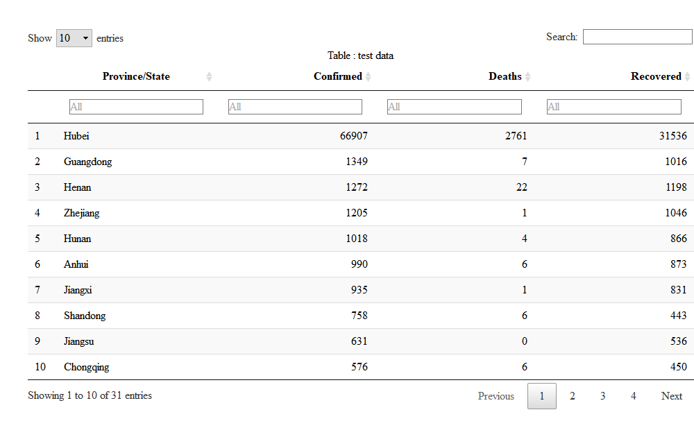
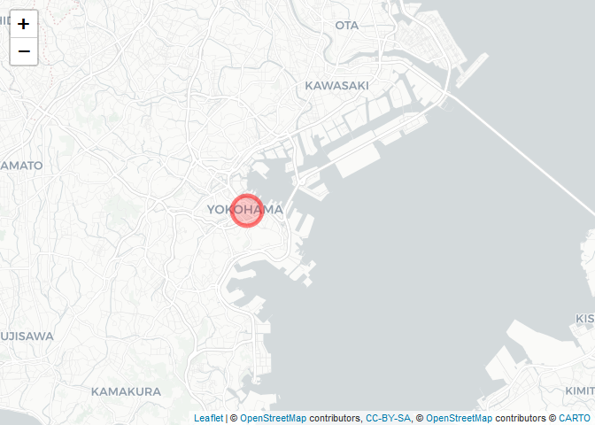
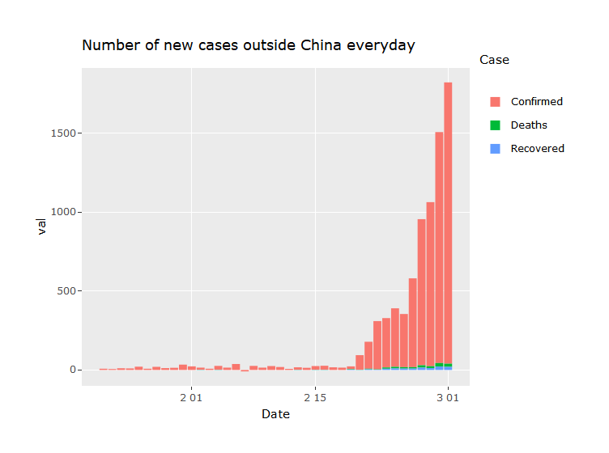
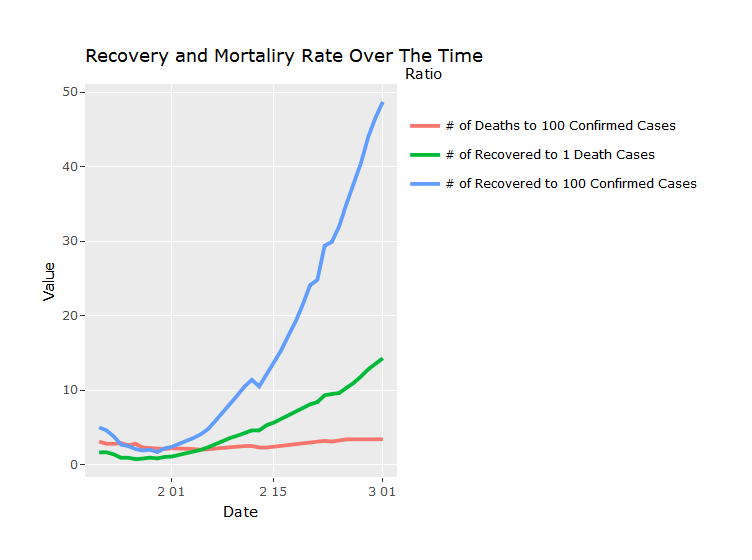

Corona-19 from Jan-22 to Feb-26
================

-   [Libraries](#libraries)
-   [Dataset](#dataset)
-   [Preprocessing](#preprocessing)
    -   [Cleaning Data](#cleaning-data)
    -   [Derived Tables](#derived-tables)
    -   [Complete Data](#complete-data)
    -   [Country Wise Latest Data](#country-wise-latest-data)
    -   [Chines Province Wise Latest Data](#chines-province-wise-latest-data)
-   [Map](#map)
    -   [Reported cases over the world](#reported-cases-over-the-world)
    -   [Reported cases in China](#reported-cases-in-china)
    -   [Cases in differnt Countries](#cases-in-differnt-countries)
    -   [Spread over the time](#spread-over-the-time)
    -   [Countries with deaths reported](#countries-with-deaths-reported)
    -   [Countries and Provinces with no recovered cases](#countries-and-provinces-with-no-recovered-cases)
    -   [Countries and Provinces with no affected case anymore](#countries-and-provinces-with-no-affected-case-anymore)
    -   [Countries and Provinces with all the cases recovered](#countries-and-provinces-with-all-the-cases-recovered)
    -   [Diamond Princess Cruise ship Status](#diamond-princess-cruise-ship-status)
-   [Hubei - China - World](#hubei---china---world)
-   [Number of new cases everyday](#number-of-new-cases-everyday)
    -   [Number of Cases](#number-of-cases)
-   [Number of Places to which COVID-19 Spread](#number-of-places-to-which-covid-19-spread)
-   [Recovery and Mortality Rate Over The Time](#recovery-and-mortality-rate-over-the-time)
-   [Proportion of Cases](#proportion-of-cases)
-   [Number of cases](#number-of-cases-1)
-   [Number of new cases](#number-of-new-cases)
-   [Number of Countries with new cases](#number-of-countries-with-new-cases)
-   [refer](#refer)
    -   [What i have to study later.](#what-i-have-to-study-later.)

Libraries
---------

Dataset
-------

Preprocessing
-------------

### Cleaning Data


[View the full\_table](https://raw.githack.com/koojaekwan/Corona-19/master/html_files/full_table.html)

### Derived Tables

    ##         Date Confirmed Deaths Recovered
    ## 1 2020-02-26     80692   2766     30374

### Complete Data


[View the Complete Data](https://raw.githack.com/koojaekwan/Corona-19/master/html_files/completedata.html)

### Country Wise Latest Data


[View the Country wise latest data](https://raw.githack.com/koojaekwan/Corona-19/master/html_files/country_wise_latest_data.html)

### Chines Province Wise Latest Data



[View the Chines Province Wise Latest Data](https://raw.githack.com/koojaekwan/Corona-19/master/html_files/chinese_province_wise_latest_data.html)

Map
---

### Reported cases over the world


[View the Reported cases over the world map](https://raw.githack.com/koojaekwan/Corona-19/master/html_files/all_over_map.html)

### Reported cases in China


[View the Reported cases in China map](https://raw.githack.com/koojaekwan/Corona-19/master/html_files/china_map.html)

In here, i didn't use the below map. just refer.
[Download the world map](http://thematicmapping.org/downloads/world_borders.php)

### Cases in differnt Countries


[View the Cases in differnt Countries - Cases](https://raw.githack.com/koojaekwan/Corona-19/master/html_files/case_in_difference_country.html)


[View the Cases in different Countrires - Deaths](https://raw.githack.com/koojaekwan/Corona-19/master/html_files/case_in_difference_country2.html)

    ##   Country.Region Deaths
    ## 1          China   2715
    ## 2           Iran     19
    ## 3          Italy     12
    ## 4    South Korea     12
    ## 5         France      2
    ## 6      Hong Kong      2
    ## 7          Japan      2
    ## 8    Philippines      1
    ## 9         Taiwan      1

### Spread over the time

### Countries with deaths reported

    ##   Country.Region Deaths
    ## 1          China   2715
    ## 2           Iran     19
    ## 3          Italy     12
    ## 4    South Korea     12
    ## 5         France      2
    ## 6      Hong Kong      2
    ## 7          Japan      2
    ## 8    Philippines      1
    ## 9         Taiwan      1

### Countries and Provinces with no recovered cases


[View the Countries and Provinces with no recovered cases](https://raw.githack.com/koojaekwan/Corona-19/master/html_files/Countries%20and%20Provinces%20with%20no%20recovered%20cases.html)

``` r
# Provinces with no cases recovered

temp <- china_latest_grouped %>% 
  filter(Recovered==0) %>% 
  dplyr::select(`Province/State`, Confirmed, Deaths, Recovered) %>% 
  arrange(-Confirmed)


temp
```

    ## # A tibble: 0 x 4
    ## # ... with 4 variables: `Province/State` <chr>, Confirmed <int>,
    ## #   Deaths <int>, Recovered <int>

### Countries and Provinces with no affected case anymore

    ##   Country.Region Confirmed Deaths Recovered
    ## 1        Vietnam        16      0        16
    ## 2          India         3      0         3
    ## 3         Russia         2      0         2
    ## 4        Belgium         1      0         1
    ## 5       Cambodia         1      0         1
    ## 6          Nepal         1      0         1
    ## 7      Sri Lanka         1      0         1

    ##   Province.State Confirmed Deaths Recovered
    ## 1        Qinghai        18      0        18
    ## 2          Tibet         1      0         1

### Countries and Provinces with all the cases recovered

    ##   Country.Region Confirmed Recovered
    ## 1        Vietnam        16        16
    ## 2          India         3         3
    ## 3         Russia         2         2
    ## 4        Belgium         1         1
    ## 5       Cambodia         1         1
    ## 6          Nepal         1         1
    ## 7      Sri Lanka         1         1

    ##   Province.State Confirmed Recovered
    ## 1        Qinghai        18        18
    ## 2          Tibet         1         1

### Diamond Princess Cruise ship Status

    ##                  Province.State Country.Region     Lat    Long       Date
    ## 36 Diamond Princess cruise ship         Others 35.4437 139.638 2020-02-26
    ##    Confirmed Deaths Recovered index
    ## 36       705      4        10  3607


[View the Diamond Princess Cruise ship Status map](https://raw.githack.com/koojaekwan/Corona-19/master/html_files/ship.html)

-   The Diamond Princess cruise ship was carrying 3,711 passengers and crew on board
-   Ship arrived in Yokohama, near Tokyo, on February 3
-   <https://www.princess.com/news/notices_and_advisories/notices/diamond-princess-update.html>

Hubei - China - World
---------------------


[View the Hubei - China - World](https://raw.githack.com/koojaekwan/Corona-19/master/html_files/Hubei_China_World.html)

Number of new cases everyday
----------------------------

 [View the Number of new cases everyday in China](https://raw.githack.com/koojaekwan/Corona-19/master/html_files/Number%20of%20new%20cases%20everyday.html)


[View the Number of new cases everyday outside China](https://raw.githack.com/koojaekwan/Corona-19/master/html_files/Number%20of%20new%20cases%20everyday2.html)

2월 7일 확진이 -인것은 뭐지?

### Number of Cases


[View the Number of Cases in China](https://raw.githack.com/koojaekwan/Corona-19/master/html_files/Number%20of%20Cases.html)



[View the Number of Cases outside China](https://raw.githack.com/koojaekwan/Corona-19/master/html_files/Number%20of%20Cases2.html)

Number of Places to which COVID-19 Spread
-----------------------------------------


-   COVID-19 spread to all the provinces of the China really fast and early
-   Number of countries to which COVID-19 spread hasn't increased that much after first few weeks

Recovery and Mortality Rate Over The Time
-----------------------------------------


[View the Recovery and Mortality Rate Over The Time](https://raw.githack.com/koojaekwan/Corona-19/master/html_files/Recovery_and_Mortality.html)

-   During the first few weeks the there were more Deaths reported per day than Recoverd cases
-   Over the time that has changed drastically
-   Although the death rate hasn't come down, the number of recovered cases has defenitly increased

Proportion of Cases
-------------------



[View the Proportion of Cases outside China](https://raw.githack.com/koojaekwan/Corona-19/master/html_files/Proportion_of_Cases.html)


[View the Proportion of Cases in China](https://github.com/koojaekwan/Corona-19/blob/master/html_files/Proportion_of_Cases2.html)


Number of cases
---------------


Number of new cases
-------------------

Number of Countries with new cases
----------------------------------




refer
-----

-   \[treemap\]<https://www.r-graph-gallery.com/236-custom-your-treemap.html>

-   \[date range in ggplot\]<https://stackoverflow.com/questions/14162829/set-date-range-in-ggplot>

-   \[Multi popup in leaflet\]<https://www.nickconti.io/interactive_election_R.html>
-   \[Multi label in leaflet\]<https://stackoverflow.com/questions/43144596/r-and-leaflet-how-to-arrange-label-text-across-multiple-lines>
-   \[leaflet tiles\]<https://rstudio.github.io/leaflet/basemaps.html>

-   \[How to add code folding\]<https://stackoverflow.com/questions/37755037/how-to-add-code-folding-to-output-chunks-in-rmarkdown-html-documents>

### What i have to study later.

-   \[treemap plotly\]<https://plot.ly/r/treemaps/> - i don't know well. is it possible?

-   \[bar chart on the leaflet map\]<https://stackoverflow.com/questions/45538831/creating-a-leaflet-map-with-custom-labels-in-r>

-   \[Cumulative Lines Animation with ggplot2\]<https://plot.ly/ggplot2/cumulative-animations/>
